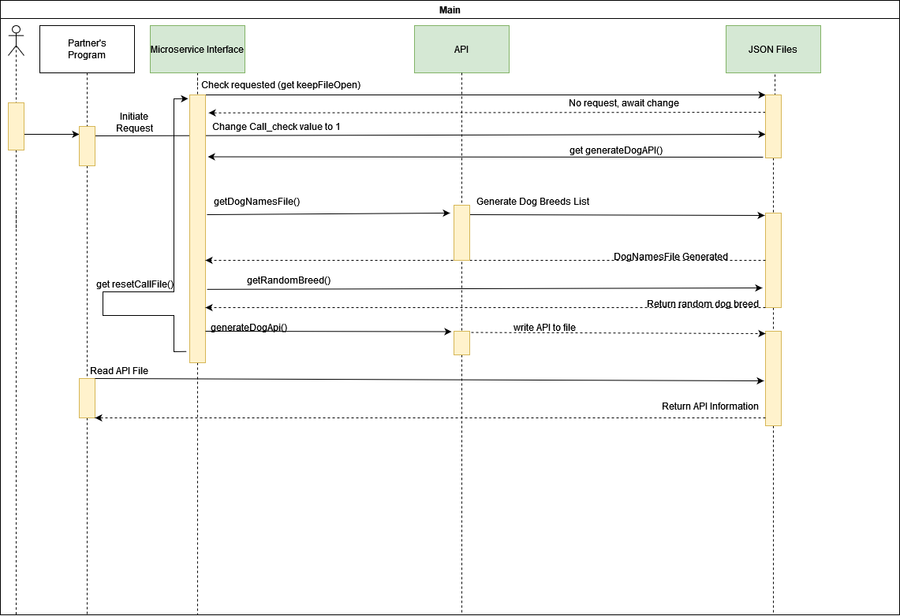

# CS-372-Microservice-Sprint-3
 After implementing the microservice according to your Sprint 2 Plan...
    Add a README to your GitHub (or update it if you already have one) that contains your communication contract. (Once you define it, don't change it! Your partner is relying on you.) README must contain...
    
## Clear instructions for how to REQUEST data from the microservice you implemented. Include an example call.  

          This program will need to be opened as the main program is running.  
          If the microservice is open for the first time, it will generate file named "call_check.json"  
          --this is how my microservice will know if it is requested.  
          During the idle period, the console of my microservice will generate a message "Awaiting for call_check.json to be written"  
          This message means that it will scan every 10 seconds for the file to be changed to its requested value.  
          Opening call_check.json, you will notice it has a value of 0.  
          In order to begin, have your main program change the value to 1, and wait for the program to begin.  
           
          ****   
          Here's how the program will work.  
          Open my microservice getRandomDog.py  
          **Main program opens and writes call_check.json a integer value of 1.**  
          Microservice begins, calling api to generate dog breed list.  
          After all dog breeds are written to dog_names.json, a random name will be chosen.  
          This random name is then sent to an API call to API Ninjas  
          Returned API information is then stored into a file random_dog.json  
          ***
            
          
### Clear instructions for how to RECEIVE data from the microservice you implemented  

    Open random_dog.json and either parse all data or choose desired data.  
    Here is an example of contents in the file.    
     [
         {
             "image_link": "https://api-ninjas.com/images/dogs/irish_water_spaniel.jpg",
             "good_with_children": 3,
             "good_with_other_dogs": 3,
             "shedding": 1,
             "grooming": 3,
             "drooling": 2,
             "coat_length": 1,
             "good_with_strangers": 3,
             "playfulness": 5,
             "protectiveness": 3,
             "trainability": 5,
             "energy": 3,
             "barking": 1,
             "min_life_expectancy": 12.0,
             "max_life_expectancy": 13.0,
             "max_height_male": 24.0,
             "max_height_female": 24.0,
             "max_weight_male": 68.0,
             "max_weight_female": 58.0,
             "min_height_male": 22.0,
             "min_height_female": 22.0,
             "min_weight_male": 55.0,
             "min_weight_female": 45.0,
             "name": "Irish Water Spaniel"
         }
     ]
         This JSON file is saved as dictionary, for example  
            data = open("random_dog.json, "r", encoding ='utf8')  
            print (data[0][0]) will return the image link response.  
 #### UML sequence diagram showing how requesting and receiving data work. Make it detailed enough that your partner (and your grader) will understand  
    
